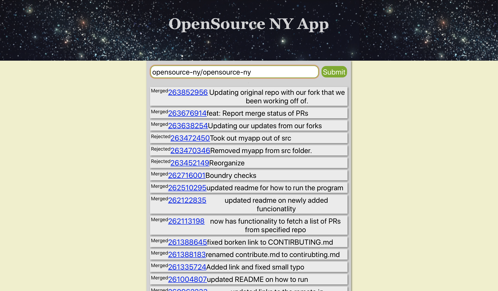
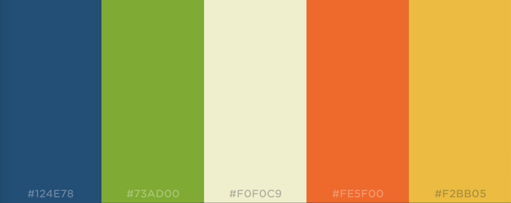

### Open Source Project Updates #2

**Hello!**

This week I worked on the frontend of OSNY.

I have made a pull request for my work, but Yi Zong has found a few bugs and I don't think this one is going to be accepted, even though it has a far better file structure and uses actual React Component separation. Besides that, I also prettified  the site, which made it look like this

Sunny and I also talked about what color-scheme would probably be good for the project, and we agreed on [this](https://coolors.co/124e78-73ad00-f0f0c9-fe5f00-f2bb05). Additions are welcome, but I think this looks pretty good.

That is it for this week!

<!-- Insert 'thats it folks' clip here -->

> Thank you for reading!
