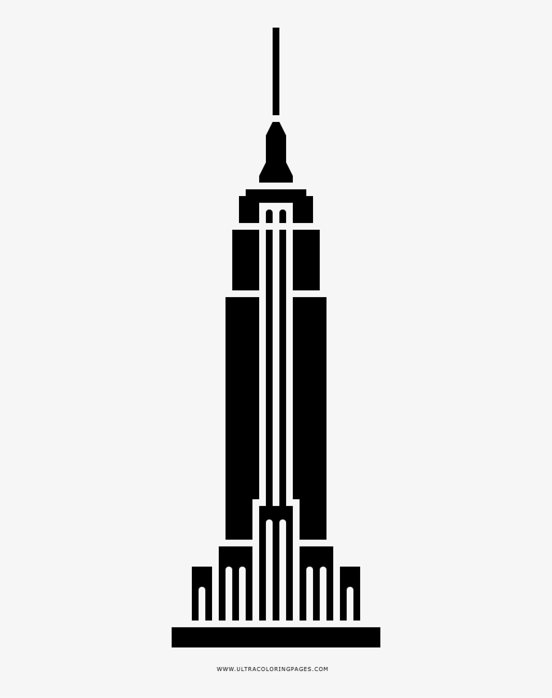

### Open SourceProject Update #3

**Hello!**

This week we have been working hard on the project, and one of the main things that Sunny and I have been working on is the logo.

The reason why so much has been put into the logo development is because a logo can either make or break a project. While the open source community may not really care about that, as well as most developers probably, the logo and the way the website feels will determine wether or not the project will be popular outside of the open source community. We certainly want this project to grow large and be used by many developers, which is why so much time has been put into the logo.

When making the logo we were thinking of ways to combine New York City and Open Source. The Open Source Logo is this: 

> Credits: Image from [www.flaticon.com](https://www.flaticon.com/free-icon/open-source_888868)

While New York doesn't really have a logo. New York does have the Empire State building and is often called the Big Apple.

> Credits: Image from [www.pngkey.com](https://www.pngkey.com/detail/u2w7q8a9e6q8a9a9_empire-state-building-silhouette-png-empire-state-building/)

My idea of the logo was to combine the two, resulting in something like this:

and

These logos are not final, and I will accept any criticism on them, but I think this is a good start. I'm thinking of organizing a vote on which logo should be *the* logo in a couple of weeks.

Besides that, [my pull request](https://github.com/hunter-college-ossd-spr19/OpenSource-NY/pull/12) has been reviewed and accepted. It contained much needed file restructuring and small redesign.

That is it for this week!

<!-- Insert 'thats it folks' clip here -->

> Thank you for reading!
