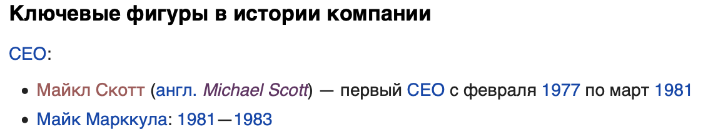
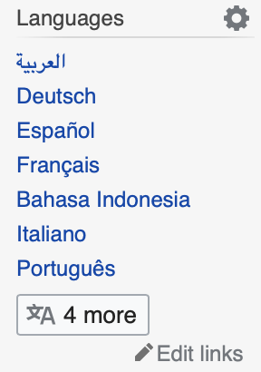

### Wiki-edit

**Hello!**

Wikipedia is a large platform with millions of articles on many different topics. Surely, somebody would make a mistake in one place or another... surely...

One man's mistake is another man's contribution. Somebody made the mistake of referencing a person without an actual reference to the person.

[Apple Inc.](https://ru.wikipedia.org/wiki/Apple) has a page in Russian and it is riddled with links to pages that don't exist in Russian. Here's what I'm talking about:

As you may see, the page for [Michael Scott](https://en.wikipedia.org/wiki/Michael_Scott_(Apple)) exists in English, but it has no Russian translation. I thought it would be much simpler for me, a native Russian speaker, to translate a page rather than find a grammatical mistake on an English article. There are obviously easy mistakes, such as a typo or simple grammar, but I feel more comfortable with translation, besides, translating a page is a more achievable and generally larger contribution to Wikipedia rather than editing existing information. I looked at [this section of the article](https://ru.wikipedia.org/wiki/Apple#Ключевые_фигуры_в_истории_компании), and picked the first missing page I found. Thankfully, there was an english version of it already and I could get to work right away. Swiftly I translated the article about Michael Scott, frankly a terrifying man, and created the page as per [wikipedia guidlines of translating a page and adding it to the language picker]() for a page previously written in other languages.

Something I found about adding translations of the page in wikipedia is that it's quite a choreful process. First you have to make the actual translation in your own word editr, then paste that into the menu of translating a language (image below), and only then you can see how the page will look. This was quite the trouble since, ideally, you would want to be able to see both, the article you are translating and what you are writing, and how that will look. I wonder if Wikipedia has an api that I could use to build such an editor...

That is it for this week!

<!-- Insert 'thats it folks' clip here -->

> Thank you for reading!
